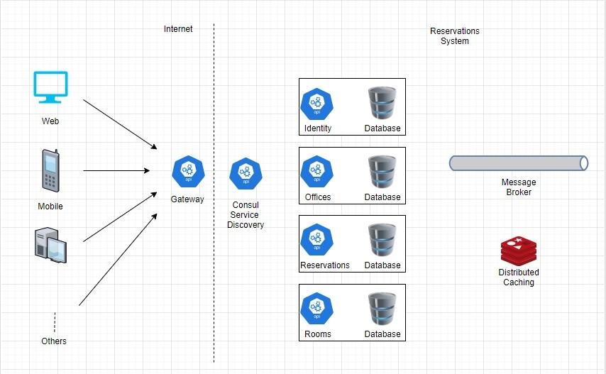

Overall
===========

This project has been prepared as a technical test request for Dephion.

The project has been prepared using microservice architecture in .Net environment. 

The bird's eye view of the project is shown in the image below.

Architecture of the system
^^^^^^^^^^^^^^^^^^^^^^^^^^

All requests from outside come to the gateway service. After the necessary operations on the gateway (routing, authentication, etc.), the request is forwarded to the relevant sub-service.

Architecturel parts of the system:
^^^^^^^^^^^^^^^^^^

    1. Service discovery: [Consul](https://www.consul.io/)
    2. Gateway: [Ocelot](https://github.com/ThreeMammals/Ocelot)
    3. Message broker: [RabbitMq](https://www.rabbitmq.com/)
    4. Distributed cache: [Redis](https://redis.io/)
    5. Containerization: [Docker](https://www.docker.com/)
    6. Development environment management: [Docker compose](https://docs.docker.com/compose/)

Solution structure
^^^^^^^^^^^^^^^^^^

There are two class libraries under the shared folder. 

 1. Reservations.Common: A common class library that each service uses to build its own structure
 2. Reservations.Services.Contracts: A shared class library containing message objects shared by services.
